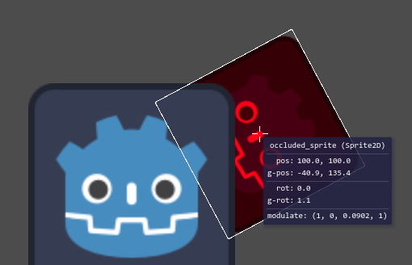
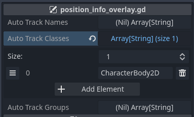

# Tracker2D

## Description

`Tracker2D` is a Godot 4.0 plugin that lets you visually track node position and orientation along
with a textual representation of various properties. In some respects it is combination of
`Marker2D` and the "Remote" scene view, but is visible during game execution instead of in the
editor, and makes the visual association of nodes and their properties immediately apparent.

It adds a marker (e.g., a cross) to the origin of the tracked node, draws a bounding box if
appropriate, and adds an information panel that reports live property values. By default it
reports the `position`, `rotation`, `global_position`, and `global_rotation` properties,
but you can specify an array of user-defined properties to track in addition to the defaults.

### Example



In the example above, the red-tinted Godot logo has a `Tracker2D` as a child, configured to also
report the `modulate` value.

The larger, untinted Godot logo is intended to show that the `Tracker2D` information (e.g, the
bounding box) is drawn on top of the scene, so it won't be occluded by other game visuals.

## Installation Instructions

1. Copy the plugin directory contents into your project as `res://addons/Tracker2D/*`.
2. Enable the plugin via the menus: `Project` -> `Project Settings...` -> `Plugins` -> `Enable`

## Basic Usage Instructions

The simplest usage is to instantiate a `Tracker2D` node, configure its properties as desired, and
add it as a child of a node you want to track.

### Example via Scripting:

```gdscript
var tracker_2d_scene : PackedScene = preload("res://addons/Tracker2D/tracker_2d.tscn")
var tracker_2d : Tracker2D = tracker_2d_scene.instantiate()
tracker_2d.display_position = false
tracker_2d.tracked_properties = [ "modulate" ]
node_of_interest.add_child(tracker_2d)
```

### Example via "Scene" UI:
	
Locate node of interest and use right-click -> "Instantiate Child Scene" to add an instance of
`res://addons/Tracker2D/tracker_2d.tscn` as a child. Use the "Inspector" of the `Tracker2D` node to
configure its properties as desired.

## Tracker2D Configuration

The following configuration properties available on `Tracker2D` nodes and can be customzed via GDScript
or as exported variables:

#### `display_name` - a `bool`, display the node name when `true`

## Auto-Tracking Nodes by Name, Class or Group

There may be situations where you want to track many nodes that share some characteristic, but
manually adding a `Tracker2D` instance to each is inconvenient. To help in such a case there is
support for automatically tracking nodes based on their name, class or groups. This is done by
monitoring the `SceneTree.node_added` signal and evaluating added nodes against your criteria.

Note that the `node_added` signal only triggers for nodes added dynamically after the game's initial
scene is fully loaded. Additionally, the class criteria is evaluated against the builtin class of
the node, *not* a user-defined class if present.

There are a few ways to setup the auto-tracking criteria.

### Auto-Tracking via UI Configuration

Open `res://addons/Tracker2D/position_info_overlay.tscn`, select the root node of the scene, use
the exported arrays to configure the names, classes and groups you want to track.



### Auto-Tracking via Scripting

In a `_ready` function of a script loaded during the main scene for your game you can assign a
list of values to the corresponding arrays for auto-tracking.

```gdscript
func _ready():
	Tracker2D_Overlay.auto_track_names = [ "auto_track_test_name" ]
	Tracker2D_Overlay.auto_track_classes = [ "PointLight2D" ]
	Tracker2D_Overlay.auto_track_groups = [ "auto_track_test_group" ]
```

## Changes

## TODO

 - add a way to configure displayed properties of auto-tracked nodes (repeat tracker2d params in overlay singleton?)
 - instead of a rect, draw an antialiased polyline
 - add window, viewport and screen position options
 - update info based on timer instead of per frame
 - add option to keep info boxes in viewport (change BG color when tracked origin is outside viewport)
 - add test cases:
 	- test rect drawing for scaling changes
